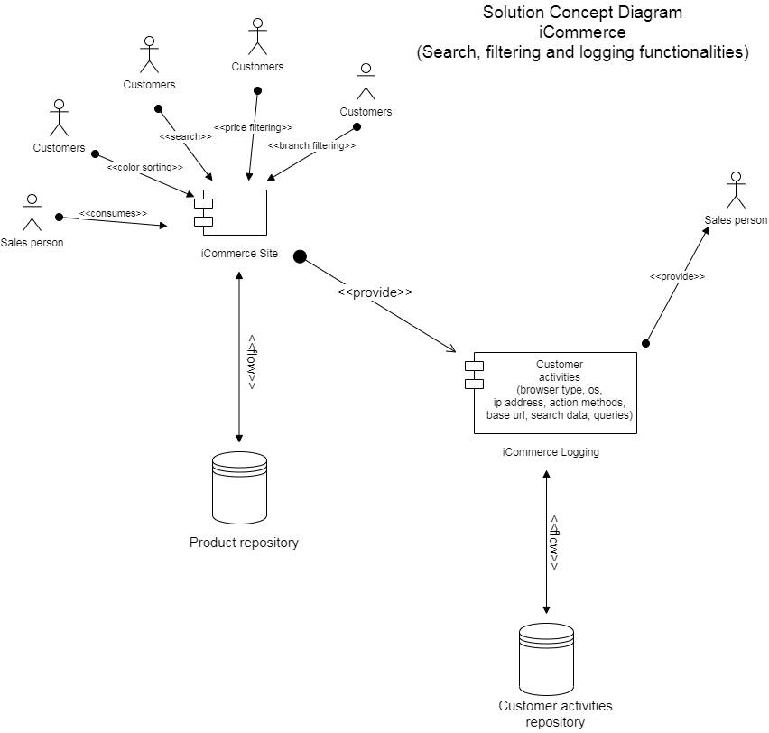

# NAB Testing Project


## Technologies
1. Babel 7
2. Node 13.14.0
3. Npm 6.14.4
4. GitHub CI
5. Dockerfile & Docker Compose
6. Nginx Reverse Proxy with cache
7. Integration test & Unit test using Jest and Sinon
8. Using eslint to checking some basic coding convention
9. Request logging with Morgan

## Getting Started 
Please follow the instruction below

### Prerequisites
You will need:
1. Mac/Linux environment
2. Github
3. Docker

### Installing (Manual)
1. Install docker on your machine or you can reference to the link to install Docker through [Homebrew](https://docs.brew.sh/Installation):
```
https://codingbee.net/docker/install-docker-for-mac-using-homebrew
```
2. Create docker network `docker network create bao_network`
3. Clone main modules:
```
git clone https://github.com/transybao1393/nab-test.git
```
4. Go to `nab-test` folder & run command `docker-compose up`
5. Clone customer activities modules:
```
git clone https://github.com/transybao1393/nab-test-customer-activities.git
```
6. Go to `nab-test-customer-activities` folder & run command `docker-compose up`

### Installing (Automatically)
1. Download file `start.sh`
2. Run on your machine, if there is Mac, please follow:
```
sh start.sh
```

### Testing
...will be update soon...

### cURL
...will be update soon...

### Architecture

#### Solution Concept Diagram


#### High-level Solution Diagram
...will be update soon...